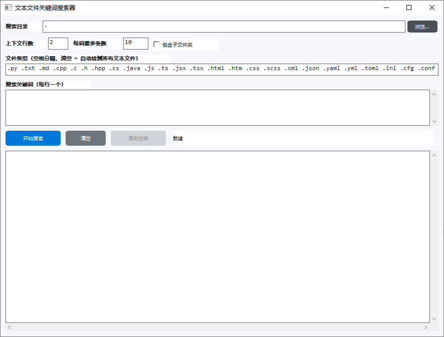

# StrSearch - 文本文件关键词搜索器

一个基于 Win32 API 的 Windows GUI 应用程序，用于在文件夹中快速搜索文本文件中的关键词。

## 功能特性

- **多关键词搜索** - 支持同时搜索多个关键词（每行一个）
- **文件类型过滤** - 可按扩展名过滤文件（如 `.cpp .txt .md`），留空则自动检测所有文本文件
- **上下文显示** - 可设置显示匹配行前后的上下文行数
- **递归搜索** - 可选是否包含子文件夹
- **结果限制** - 可设置每个关键词最多显示的匹配条数
- **结果复制** - 一键复制搜索结果到剪贴板
- **现代化 UI** - 采用圆角按钮、柔和配色和清晰布局

## 支持的文件类型

默认支持以下文本文件格式：
```
.py .txt .md .cpp .c .h .hpp .cs .java .js .ts .jsx .tsx
.html .htm .css .scss .xml .json .yaml .yml .toml .ini
.cfg .conf .env .bat .cmd .sh .ps1 .sql .r .go .rs
.kt .lua .rb .php .log .csv
```

## 编译方法

使用 MinGW-w64 或 MSVC 编译：

```bash
# MinGW-w64
g++ -std=c++17 -O2 -mwindows strsearch.cpp -o strsearch.exe -lcomctl32 -lole32 -lshell32

# MSVC
cl /std:c++17 /O2 strsearch.cpp /link comctl32.lib ole32.lib shell32.lib
```

## 使用方法

1. 运行 `strsearch.exe`
2. 选择要搜索的目录（默认当前目录）
3. 在文件类型框中输入要搜索的扩展名（空格分隔），或留空自动检测
4. 在关键词框中输入要搜索的关键词（每行一个）
5. 设置上下文行数和每词最大匹配数
6. 点击「开始搜索」按钮
7. 使用「复制结果」按钮将结果复制到剪贴板

## 界面截图



## 系统要求

- Windows 7 或更高版本
- 支持 C++17 的运行库

## 许可证

MIT License
